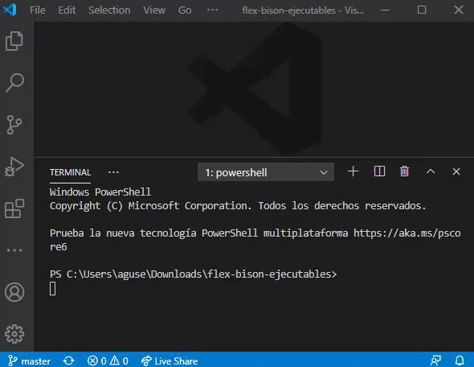

# Ejecutables

Hay en el repo un par de archivos de los cuales, dependiendo del sistema operativo, se tiene que elegir uno para copiar y pegar en el directorio en donde se encuentra el archivo `.l` de flex. En el caso de [Windows](#windows) se usa el batch **flexw10.bat** y en caso de [Linux](#linux) se usa el script **flex.sh**.

# Windows

Primero, hay que modificar el archivo, agregando la ruta en la que se tiene instalado Flex. Esto se puede hacer utilizando cualquier aplicación de bloc de notas, o el mismo Visual Studio Code. Es **muy importante** que esté instalado en una ruta **sin espacios**. Ejemplo:

```
set ruta_flex="C:\FlexBison\lib"
```

## Funcionamiento del Batch

Se puede correr de 2 formas:

1. Especificando el nombre del archivo de salida:
```
.\flexw10.bat flex_entrada.l ejecutable_salida.exe
```

2. Sin especificar el nombre del archivo de salida, generando un archivo `a.exe`:
```
.\flexw10.bat flex_entrada.l
```

## Alternativa: uso del Script con Git Bash

Otra opción a tener en cuenta es que se puede utilizar la consola Git Bash para correr el script `flex.sh`. Para esto, se debe **configurar Git Bash como consola por defecto**:



Se debe agregar la **ruta a las bibliotecas de Flex** en la línea donde se ejecuta el comando gcc (en la línea 16):
```
gcc lex.yy.c -L "C:\FlexBison\lib" -lfl -o $EJECUTABLE
```
Además, recomendaría **cambiar a `.exe` la extensión del archivo generado por defecto**.

[El funcionamiento es el mismo que en Linux](#funcionamiento-del-script), pero a eso se le suma que el ejecutable a generar también puede ser tipo `.exe`. 

# Linux

## Posible problema: Instalación de Flex

Me pasó que **Linux ya tenía flex instalado pero no reconocía la biblioteca -lfl** a pesar de haber corrido el comando `sudo apt-get install flex`. Esto pasa porque esta instalación no incluía el archivo `lifbl.a`, que debía estar dentro de la carpeta `\usr\lib\`.

Se resuelve instalando otra versión de flex llamada **flex-old**, con el siguiente comando:
```
sudo apt install flex-old
```

## Funcionamiento del Script

Se puede correr de 2 formas:

1. Especificando el nombre del archivo de salida:
```
./flex.sh flex_entrada.l ejecutable_salida.out
```

2. Sin especificar el nombre del archivo de salida, generando un archivo `a.out`:
```
./flex.sh flex_entrada.l
```

## Posible problema: Permiso denegado al script

Al ejecutar el script, puede que aparezca el siguiente mensaje:
```
bash: ./flex.sh: Permiso denegado
```

Para otorgar los permisos necesarios, alcanza con ejecutar el comando:
```
chmod +x ./flex.sh 
```
